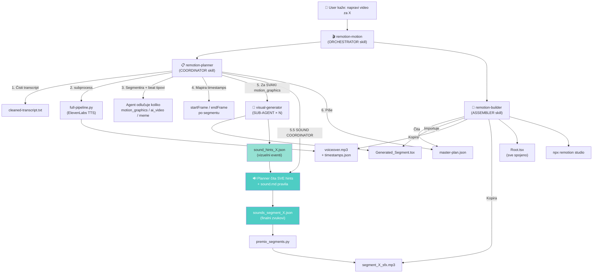
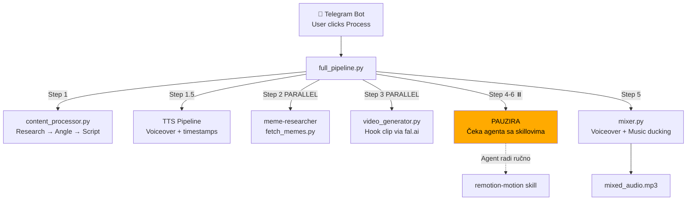

# Pipeline Architecture — Complete Map

**Poslednji update:** 2026-04-05
**Status:** Post-audit, pre-fix

---

## Mermaid: Ko poziva koga



## Mermaid: Automated Pipeline (full_pipeline.py)



---

## Tabela: Svaki Agent — Ulaz/Izlaz/Ko ga zove

| # | Agent | Ko ga zove | Input | Output | Gde čuva | Spawns sub-agents? |
|---|-------|-----------|-------|--------|----------|-------------------|
| 1 | **remotion-motion** | User direktno | Transcript | Ništa (orchestrator) | - | Govori useru da pokrene planner pa builder |
| 2 | **remotion-planner** | remotion-motion ili user | Transcript tekst | master-plan.json, voiceover.mp3, timestamps.json, Generated_*.tsx | workspace/{slug}/ + videos/{slug}/ | **DA — visual-generator × N** |
| 3 | **visual-generator** | remotion-planner (N puta) | Transcript segment + timestamps + fps + startFrame | Generated_{Name}.tsx + sounds_segment_X.json | videos/{slug}/src/visuals/ + workspace/{slug}/ | Ne |
| 4 | **remotion-builder** | remotion-motion ili user | master-plan.json + Generated_*.tsx + voiceover.mp3 | Root.tsx + package.json + Remotion projekat | videos/{slug}/ | Ne |
| 5 | **meme-researcher** | full_pipeline.py (parallel) | Video title | memes_{slug}.json | workspace/{slug}/ | Ne |
| 6 | **full_pipeline.py** | Telegram bot ili CLI | topic_id | Sve od step 1-3, 5 | workspace/{slug}/ | Ne (subprocess-i, ne agente) |

---

## Detaljni Flow: Transcript → Video

### FAZA 1: Automatski (full_pipeline.py)

```
1. content_processor.py
   Input:  topic_id iz DB
   Output: script_text u DB
   
2. full-pipeline.py (TTS)
   Input:  cleaned-transcript.txt
   Output: voiceover.mp3 + voiceover-timestamps.json
   Metod:  ElevenLabs API (Chris voice, multilingual_v2)
   
3. fetch_memes.py (PARALLEL)
   Input:  video title
   Output: memes_{slug}.json
   Metod:  Reddit API + Imgflip API
   
4. video_generator.py (PARALLEL)
   Input:  hook prompt
   Output: ai-clips/hook.mp4
   Metod:  fal.ai (Flux → Minimax)
   Ima:    Quality gate (retry ako <100KB slika, <500KB video)
   
5. mixer.py
   Input:  voiceover.mp3 + bg-lofi-tech.mp3 + timestamps
   Output: mixed_audio.mp3
   Metod:  pydub ducking
```

### FAZA 2: Agent sa skillovima (ručno)

```
6. remotion-planner (KORAK 1-2: čisti + TTS)
   ⚠️ PRESKAČE ako full_pipeline.py već napravio voiceover
   
7. remotion-planner (KORAK 3: segmentacija + beat tipovi)
   Input:  Transcript + memes.json + ai-clips/ info
   Output: Segmenti sa beatType (agent odlučuje koliko):
           - motion_graphics → treba .tsx
           - ai_video → samo prompt u master-plan
           - meme → samo meme info u master-plan
   
8. remotion-planner (KORAK 4: timestamps → frames)
   Input:  voiceover-timestamps.json
   Output: startFrame/endFrame po segmentu
   
9. remotion-planner (KORAK 5: spawns visual-generator)
   Za SVAKI motion_graphics segment:
     → Pokreće visual-generator sub-agent
     → Sub-agent čita: transcript segment + timestamps
     → Sub-agent piše: Generated_{Name}.tsx
     → Sub-agent TREBA pisati: sounds_segment_X.json ← BROKEN
   
10. remotion-planner (KORAK 6: master-plan.json)
    Piše finalni master-plan sa svim segmentima
   
11. remotion-builder
    Input:  master-plan.json + svi Generated_*.tsx + voiceover.mp3
    Output: Root.tsx + komplettan Remotion projekat
    Pokrene: npx remotion studio
```

---

## PROBLEMI (nađeni u auditu) — Status

### ✅ REŠEN — PROBLEM 1: Zvukovi NE RADE (95% projekata)

**Fix:** Hints + Sound Coordinator arhitektura (Opcija 3).
- Visual-generator sad piše `sound_hints_X.json` (samo vizuelni eventi, stroga šema)
- Sound Coordinator (planner KORAK 5.5) čita SVE hints i piše finalne `sounds_segment_X.json`
- Hints su LAKI za sub-agenta (samo opisuje šta se dešava), teži posao radi coordinator

### ✅ REŠEN — PROBLEM 2: Frame numbering inconsistency

**Fix:** Eksplicitan `frameMode: "global"` u svakom JSON-u.
- sound_hints_X.json ima `frameMode: "global"` (obavezno)
- sounds_segment_X.json ima `frameMode: "global"` (obavezno)
- premix_segments.py čita `frameMode` polje umesto heuristic detekcije
- Legacy fallback i dalje postoji za stare JSONe

### 🟡 OTVORENO — PROBLEM 3: Meme je CEO segment

**Status:** Planner ima beat tip "meme" per-segment. Treba prebaciti na meme overlay UNUTAR motion_graphics segmenta (3-5 sec). Sledeći fix.

### ✅ REŠEN — PROBLEM 4: Niko ne gleda celinu

**Fix:** Sound Coordinator (planner KORAK 5.5) gleda SVE segmente odjednom.
- Proverava density (8-12/min), varijaciju, boundary transitions
- Jedan mozak za celu kompoziciju

### 🟡 OTVORENO — PROBLEM 5: MP3 codec latency

**Status:** 10-20ms latency. Manji prioritet.

### 🟢 MANJI — PROBLEM 6: Silent failure na missing files

**Status:** premix_segments.py i dalje preskače missing fajlove. Manji prioritet.
